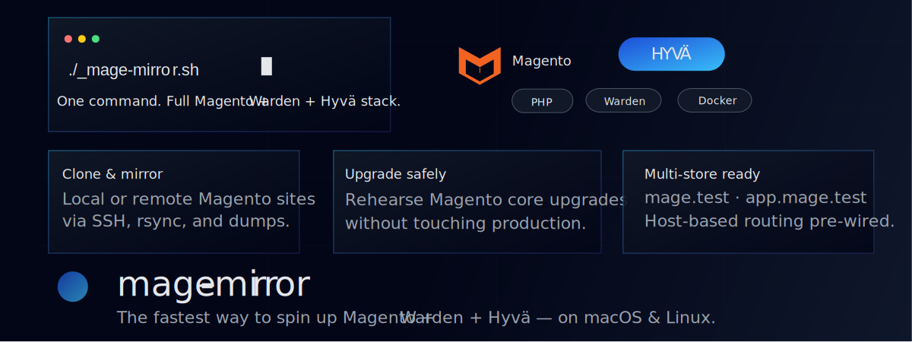

# 🚀 mage-mirror
### The Fastest Way to Spin Up Magento + Warden + Hyvä — On macOS & Linux

Fresh installs, Hyvä auto-setup, remote cloning, Magento upgrades, and multi-store routing — all from one script.

**One command. Zero frustration.**


 



## 🏷️ Badges


---

## 🎥 Quick Demo


---

## 🌟 What is mage-mirror?

mage-mirror is a high-speed Magento development environment generator built for Warden, Docker, and Hyvä.

It automates:

- Fresh Magento installs
- Hyvä theme installation
- Cloning local or remote sites
- Magento upgrades
- Multi-store routing
- SSH sync via rsync or tar
- OpenSearch reconfiguration
- Full Warden environment setup

Everything runs through:

- `_mage-mirror.sh`
- `_mage-mirror.config`

---

## 🏁 Quick Start

```bash
git clone https://github.com/j-scriptz/mage-mirror.git
cd mage-mirror
chmod +x _mage-mirror.sh
```
then
```bash
./_mage-mirror.sh
```
or
```aiignore
sh _mage-mirror.sh
```

Environment URLs:

- https://mage.test  
- https://app.mage.test (if multi-store enabled)

---

## 🚀 Key Features

### ⚡ Fresh Magento Installs
- Composer create-project  
- Admin creation  
- Hyvä auto-install  
- Sample data support  
- DI compile + static deploy  
- OpenSearch configuration  

---

### 🔁 Clone Magento Sites
Supports:

- Local SQL + env.php/config.php
- Remote over SSH
- Remote DB via mysqldump
- Remote rsync/tar sync modes

Modes:

- Code only  
- DB only  
- Code + DB  
- Code + DB (no media)  
- Full sync  

---

### ⬆️ Magento Upgrade Mode

```bash
UPGRADE_MAGENTO=yes
UPGRADE_MAGENTO_VERSION=2.4.*
```

mage-mirror will:

1. Import site  
2. Adjust Composer constraints  
3. Run composer update  
4. Run setup:upgrade  
5. Build static assets  

---

### 🌐 Multi-Store Routing

| Domain        | Website |
|---------------|---------|
| app.mage.test | base    |
| mage.test     | subcats |

Also:

- Writes to `/etc/hosts`
- Patches pub/index.php
- Sets base URLs

---

## ⚙ Configuration: `_mage-mirror.config`

Example:

```bash
PROJECT_NAME=mage
MAGENTO_VERSION=2.4.*
INSTALL_HYVA=ask
WITH_SAMPLE_DATA=ask
USE_EXISTING_DB=ask
USE_RSYNC_MAGENTO=ask
USE_REMOTE_DB_DUMP=no
ENABLE_MULTISTORE=ask
UPGRADE_MAGENTO=ask
UPGRADE_MAGENTO_VERSION=2.4.*
```

Supports: yes, no, ask

---

## 🧪 Example Commands

### Fresh install (Hyvä + sample data)

```bash
PROJECT_NAME=mage USE_EXISTING_DB=no WITH_SAMPLE_DATA=yes INSTALL_HYVA=yes ./_mage-mirror.sh
```

### Clone from local dump

```bash
PROJECT_NAME=mage USE_EXISTING_DB=yes EXISTING_DB_SQL=db/site.sql EXISTING_ENV_PHP=config/env.php ./_mage-mirror.sh
```

### Clone remote + upgrade

```bash
PROJECT_NAME=mage USE_EXISTING_DB=yes USE_RSYNC_MAGENTO=yes USE_REMOTE_DB_DUMP=yes UPGRADE_MAGENTO=yes UPGRADE_MAGENTO_VERSION=2.4.* ./_mage-mirror.sh
```

---

## ❤️ Optional: Jscriptz Subcats

Hyvä + Luma compatible subcategory card module:  
https://mage.jscriptz.com/jscriptz-subcats.html

---

## 🤝 Contributing

PRs and feature requests welcome.

If mage-mirror saved you time:

**⭐ Please star the repo — it helps visibility!**

---

## 📄 License

GNU Public License v3.0
